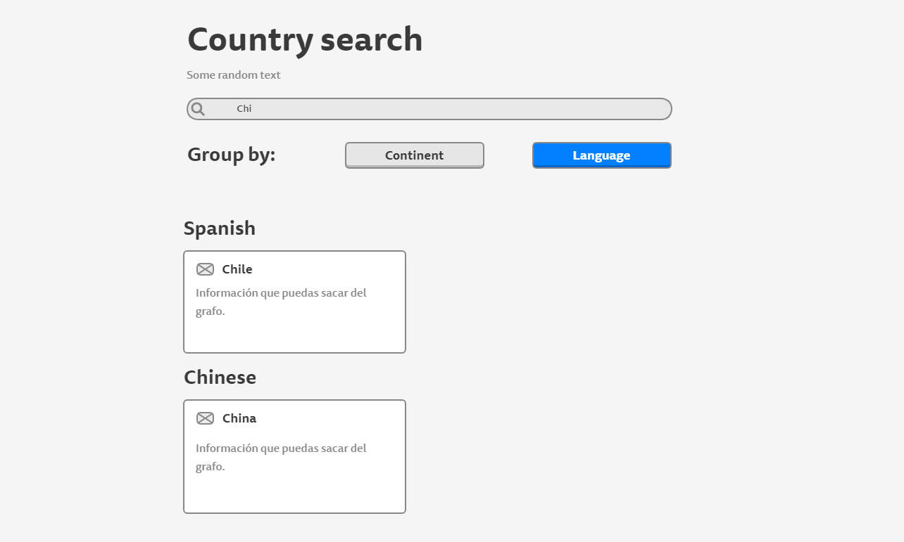

# Desafío para Software Engineers

- Nombre postulante: **Nicolás Giacaman**
- Link a la app en producción: https://kimche-challenge.pages.dev/

## Cambios

> Actualmente el repositorio pasa a ser público para comparar distintas librerias

> (ApolloClient no es compatible con React 18 😢)

## Stack

- React v18
- Vite v2
- Redux Toolkit v1

## Comparación

| Librería      | Bundle JS | Bundle CSS |     Repo     |   Online   |
|---------------|:---------:|:----------:|:------------:|:----------:|
| React Webpack |   306 KB  |    57 KB   |      N/A     |     N/A    |
| React Vite    |   172 KB  |    55 KB   | [Github][g1] | [Demo][d1] |
| Vue3 Vite     |   61 KB   |    55 KB   | [Github][g2] | [Demo][d2] |
| Svelte        |   14 KB   |    56 KB   | [Github][g3] | [Demo][d3] |

[g1]: https://github.com/nicolasegp/kimche-challenge
[g2]: https://github.com/nicolasegp/kimche-challenge-vue
[g3]: https://github.com/nicolasegp/kimche-challenge-svelte

[d1]: https://kimche-challenge.pages.dev/
[d2]: https://kimche-challenge-vue.pages.dev/
[d3]: https://kimche-challenge-svelte.pages.dev/

## Instrucciones

Debes crear un buscador de países consultando el [siguiente grafo](https://countries.trevorblades.com/). Este código contiene una base para seguir con la aplicación en React y ApolloClient. Queda a disposición tuya cualquier cambio, ya sea de estructura, estilo, etc.

Se espera que logres hacer una aplicación parecida a la del siguiente diagrama:

La funcionalidad y estructura debe ser igual, pero el diseño y variantes (por ejemplo, cambiar colores de las cosas) queda a tu gusto. **Considerar que el ícono al lado del nombre de cada país es el emoji**.

Además de esto, se espera que hagas deploy de tu app en el servicio que desees (Heroku, Netlify, AWS, Github Pages, etc).
