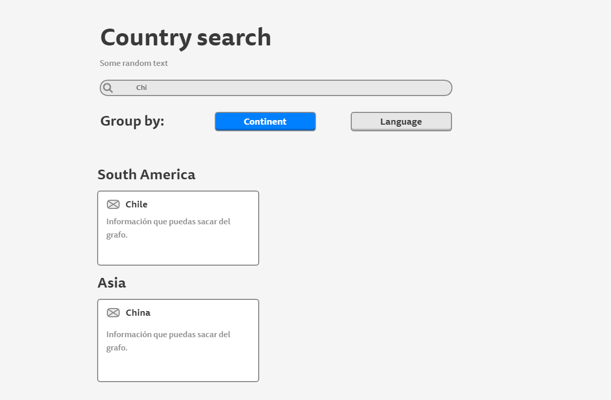

# Desafío para Software Engineers

- Nombre postulante: **Nicolás Giacaman**
- Link a la app en producción: https://kimche-challenge.pages.dev/

## Cambios

Actualmente el repositorio pasa a ser público, tambien se creo un proyecto alterno escrito en Svelte para comprar los archivos resultantes.
El proyecto en Svelte se puede ver en: [Kimche Challenge _(Svelte)_](https://github.com/nicolasegp/kimche-challenge-svelte)

- **v2**
  - Prueba del Stack: Vite, React 18, Redux Toolkit
  - ApolloClient no es compatible con React 18 😢

## Instrucciones

Debes crear un buscador de países consultando el [siguiente grafo](https://countries.trevorblades.com/). Este código contiene una base para seguir con la aplicación en React y ApolloClient. Queda a disposición tuya cualquier cambio, ya sea de estructura, estilo, etc.

Se espera que logres hacer una aplicación parecida a la del siguiente diagrama:

La funcionalidad y estructura debe ser igual, pero el diseño y variantes (por ejemplo, cambiar colores de las cosas) queda a tu gusto. **Considerar que el ícono al lado del nombre de cada país es el emoji**.

Además de esto, se espera que hagas deploy de tu app en el servicio que desees (Heroku, Netlify, AWS, Github Pages, etc).
